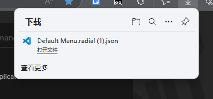
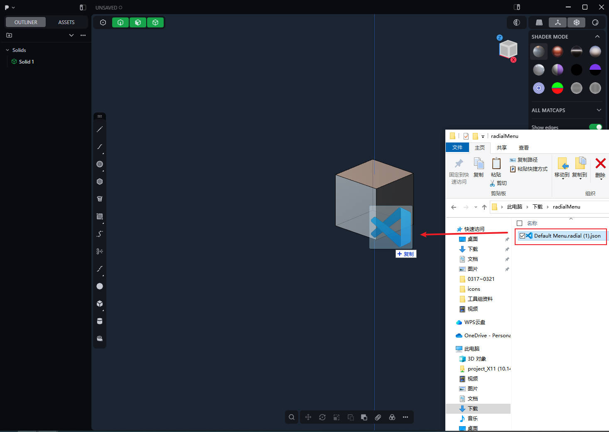
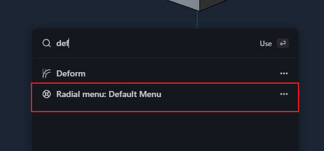
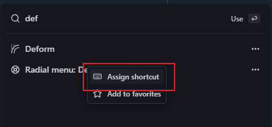

  

<h1 align="center">Plasticity Radial Menu Editor</h1>

English | [中文](doc/README_zh.md) 
[Changelog](doc/Changelog.md)

<h3 align="center">
  An open-source tool designed for customizing Plasticity's radial menu.
</h3>

  

 

## 🏎️ Quick start
Click [Demo](https://pepperkun.github.io/plasticity-radial-menu-editor/) to open the website directly for use

Download the prepared radial menu JSON data

Drag and drop the JSON file into the Plasticity interface

In Plasticity, press shortcut key ​F to ​search for the created circular menu

Right-click to ​assign shortcut keys to the circular menu

## ✨ Features
### 🖥 Graphical Interface
- Drag-and-drop interaction design for intuitive menu hierarchy management
- Real-time preview of menu layout and style modifications (WYSIWYG)

### 🔄 Radial Menu Management
- ​**Create** multi-level nested menus

- ​**Modify** menu labels/ordering
- ​**Delete** redundant menu items

### 🔍 Smart Command Search
- Fuzzy search to quickly locate Plasticity commands

##  🔧 Development Roadmap
- [X] Radial menu configuration import
- [X] Chinese language support
- [ ] Real-time editing data saving
- [ ] Operation history tracking
- [ ] MatCap customization feature

## ☕ Support Me
If this project has improved your workflow, consider buying me a coffee!

|                       Alipay Donation                        |
|:------------------------------------------------------------:|
|  <!-- Replace with QR code path --> |

--- 

## License
[Apache-2.0 license](LICENSE)